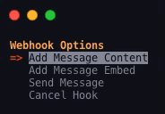

<h1><a href="https://discord.com/developers/docs/resources/webhook">Webhook</a>r</h1>

<p align=center>


</p>

A simple (and terribly written) friendly terminal interface to send webhooks over [discord](https://discord.com), piggybacking on the [discord.py](https://github.com/Rapptz/discord.py) webhook support. Currently on version `1.1.1`

# Setup

This setup guide assumes you have at least [python3](https://python.org) installed.

```sh
# Clone the repository
git clone https://github.com/Zidaan-Hayat/Webhookr.git

# Go into the repository
cd Webhookr

# Install all the required modules
python3 -m pip install -r requirements.txt

# Run the file
python3 main.py
```

# Usage

Once you run the file, you get a simple up and down selection tool which can be found [here](https://pypi.org/project/simple-term-menu/) [or here](https://github.com/IngoMeyer441/simple-term-menu) and is a very useful tool, simply use the `UP`, `DOWN` keys or the `j`, `k` keys to navigate.

If at any time you want to cancel a process, there should be a `Cancel` or `Stop` option. Otherwise you can enter `CTRL+C`



# Disclaimer

None of the modules imported were made by me and a lot of the resources used in the code were created by other people. See them all here:

- [`discord.py` by Rapptz](https://github.com/Rapptz/discord.py)
- [`simple_term_menu` by IngoMeyer441](https://github.com/IngoMeyer441/simple-term-menu)
- [`colorful` by timofurrer](https://github.com/timofurrer/colorful)

- ~~[`colorama` by tartley](https://github.com/tartley/colorama)~~
- ~~[`termcolor` by vaultboy](https://pypi.org/project/termcolor/)~~

---

Thank you :)
